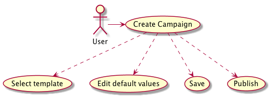
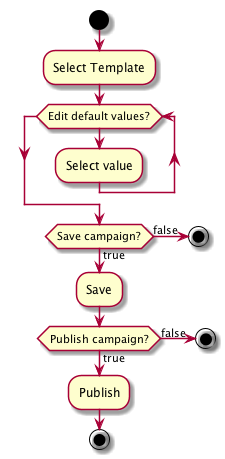
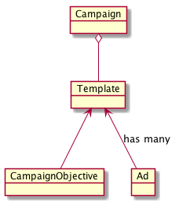

# Advertising Campaign Creator
This repository cotains the documentation and source for a modeling expercise.

## Overview
The advertising campaign createor needs to be able to create campaigns from different templates. These templates define the campaigns structure and any default values. 

## Objective
The objective is to be able to create, save, and publish a campaign created from any of the templates.

## Design
This section details the applications inner workings.   

### Use Case

### Activity Diagram

### Domain

## Getting Started
To run the application you need to run both the Campaign service and UI.   

Run with Docker:   

If you have go and node installed you can follow these instructions.

1. `cd assets`
2. `yarn`
3. `yarn build`
4. `cd ..`
5. `go build`
6. `./service`
7. Visit [localhost:3000](http://localhost:3000)